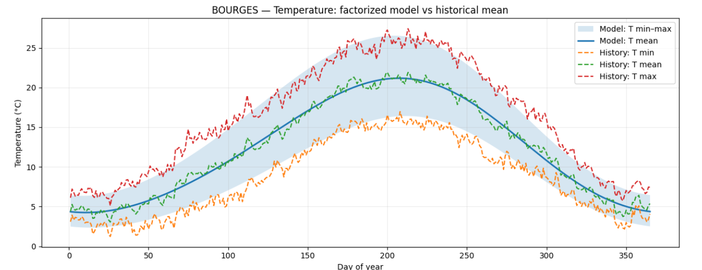
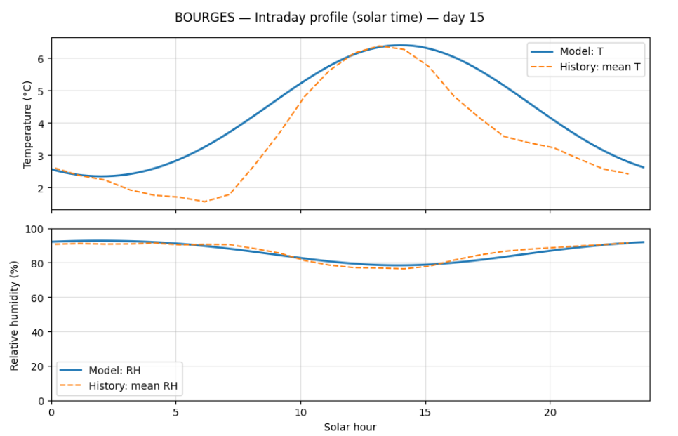

# HarmoClimate Model Generator

HarmoClimate is a suite of Python utilities that extract hourly weather observations for a single Météo-France station and generate **an ultralight, location-tuned climate baseline for hourly outdoor temperature and humidity.**

Code templates are provided to embed generated models in other applications and languages (for example C++), typically in **only a few dozen lines of code and without any additional dependencies.**

The model deliberately uses a very small set of harmonic, explainable parameters so that each component can be inspected, understood, and manually adjusted if needed.

## Models Use Cases

- Estimate typical outdoor temperature and humidity cycles to support HVAC sizing, setpoint strategies, and lightweight energy simulations.
- Embed a deterministic, low-footprint climate model in firmware for low-power or offline environmental monitoring devices.
- Provide localized weather context when high-resolution forecasts are unavailable or too heavy, for example in games, simulations, or demos.
- Validate and sanity-check sensor or telemetry data against a reproducible local climate baseline to detect drifts or outliers.

**It is not intended to predict real-time weather events.**

## Bourges Showcase

The repository ships with a Bourges (Cher, France) example that demonstrates the full pipeline and generated model output.




## Generator Features

- Streams historical hourly observations for a French department directly from public Météo-France archives.
- Filters the source data down to a single station (configurable) and converts timestamps from local time to solar time.
- Trains four small PyTorch models: annual temperature, annual humidity, diurnal temperature residual, and diurnal humidity residual.
- Evaluates the fitted models with simple mean absolute error (MAE) metrics.
- Exports model parameters and metadata as JSON and generates a self-contained C++ header for embedded use.
- Provides optional visualisation helpers for comparing the generated model to historical climatology.

## Project Layout

```
.
├── main.py                          # Backwards-compatible CLI entry point
├── src/
│   └── harmoclimate/
│       ├── __init__.py              # Package exports
│       ├── config.py                # Station configuration + filesystem layout
│       ├── data_ingest.py           # Remote CSV streaming and preprocessing
│       ├── metadata.py              # Station metadata aggregation helpers
│       ├── pipeline.py              # End-to-end orchestration
│       ├── template_cpp.py          # C++ header generation utilities
│       ├── training.py              # PyTorch models and training routines
│       └── display.py               # Plotting and interactive inspection helpers
├── generated/
│   ├── data/                        # Filtered datasets (Parquet)
│   ├── models/                      # Exported JSON parameter bundles
│   └── templates/                   # Generated C++ headers
├── README.md
└── AGENTS.md
```

The `generated/` directory is tracked with placeholder files so that the folder structure exists in the repository, while the actual artefacts (Parquet, JSON, C++ headers) are ignored by Git.

## Configuration

Station-specific configuration lives in `src/harmoclimate/config.py`:

| Parameter | Description | Default |
|-----------|-------------|---------|
| `STATION_CODE` | Eight-digit `NUM_POSTE` identifier used as the default when no station code is provided to the CLI. | `"18033001"` (Bourges) |
| `COUNTRY_CODE` | ISO 3166-1 alpha-2 code stored in metadata. | `"fr"` |
| `MODEL_VERSION` | Version string embedded in exported metadata. | `"1.0"` |
| `CHUNK_SIZE` | Number of rows per streamed CSV chunk. | `200_000` |
| `RANDOM_SEED` | Seed for PyTorch training reproducibility. | `42` |
| `SAMPLES_PER_DAY` | Number of samples used in visualization helpers. | `96` |

Helper functions such as `department_code_from_station()` and `build_artifact_paths()` derive the department code, file URLs, and output locations automatically. The pipeline inspects the dataset to fetch the station's `NOM_USUEL`, slugifies it, and then writes artefacts under the basename `{country_code}_{station_slug}` (e.g. `fr_bourges`).

## Prerequisites

- Python 3.10+
- `pyarrow` (installed via the project dependencies)
- POSIX-compatible shell (`bash`) to run project scripts

Set up a local development environment with the helper script:

```bash
./scripts/setup.sh
```

This creates `.venv/`, installs PyTorch from the official CPU wheel index, and installs the project in editable mode. To reuse the environment later, activate it via:

```bash
source ./scripts/activate.sh
```

## Usage

The CLI exposes two workflows. All artefacts are written under `generated/{data,models,templates}/`.

1. **Generate a fresh model for a station code.**
   ```bash
   python main.py generate 18033001
   ```
   The command will:
   - Download and stream historical CSV archives for the department inferred from the `NUM_POSTE`.
   - Filter rows matching the provided station code and compute solar-time features.
   - Persist the filtered dataset to `generated/data/{country_code}_{station_slug}.parquet`.
   - Fit the four harmonic models in sequence using PyTorch.
   - Report global MAE metrics for temperature (°C) and relative humidity (%).
   - Export the learned parameters and metadata to `generated/models/{country_code}_{station_slug}.json`.
   - Generate a C++ header (`generated/templates/{country_code}_{station_slug}.hpp`) with inline prediction helpers.

2. **Regenerate outputs from an existing model JSON.**
   ```bash
   python main.py regenerate fr_bourges.json
   ```
   - If the corresponding cached Parquet dataset is present, it is loaded directly.
   - Otherwise the pipeline re-streams the archives using the `station_code` stored in the JSON metadata.
   - Training, evaluation, and export steps mirror the `generate` command.

3. **Optional visualisations.**
   The `src/harmoclimate/display.py` module exposes functions to render yearly temperature and humidity curves or compare the model against historical climatology. Ensure `matplotlib` (and `ipywidgets` for interactive plots) is installed before calling these utilities.

4. **Backwards-compatible default.**
   Running `python main.py` with no arguments still executes the pipeline using the `STATION_CODE` defined in `src/harmoclimate/config.py`. This is useful when scripting or when a default station is preferred.

## Generating a New Model

To produce a model for another French station, prefer the CLI:

1. Invoke `python main.py generate <NUM_POSTE>` with the desired station code.
2. Optionally adjust `MODEL_VERSION` in `src/harmoclimate/config.py` if you want to embed a custom revision tag in the metadata.
3. Review the output JSON and C++ header inside `generated/` to confirm the metadata and coefficients align with the intended station.

## Model Parameters

**Each parameter controls either seasonality (annual terms), the day–night shape (diurnal terms), or the T→RH coupling, and every coefficient can be adjusted manually without extra dependencies.**

### Site parameters (location and solar time)

| Symbol         | Parameter name      | Unit      | Description                                                                       |
| -------------- | ------------------- | --------- | --------------------------------------------------------------------------------- |
| **λ**          | `longitude_deg`     | degrees E | **Station longitude used to shift from UTC to local solar time.**                 |
| **φ**          | `latitude_deg`      | degrees N | **Station latitude.** Stored as metadata for the generated model.                 |
| **Δ₍UTC→sol₎** | `delta_utc_solar_h` | hours     | **Offset to convert UTC hour to solar hour.** Used in the prediction entry point. |

### Annual temperature component

| Symbol   | Parameter name | Unit | Description                                                             |
| -------- | -------------- | ---- | ----------------------------------------------------------------------- |
| **μₜ**   | `annual_T_mu`  | °C   | **Annual mean temperature in solar time.**                              |
| **Aₜ,₁** | `annual_T_A1`  | °C   | **Main annual temperature amplitude (dominant seasonality).**           |
| **φₜ,₁** | `annual_T_ph1` | rad  | **Phase of the first annual harmonic (shifts the seasonal peak).**      |
| **Aₜ,₂** | `annual_T_A2`  | °C   | **Second annual harmonic amplitude (refines winter/summer asymmetry).** |
| **φₜ,₂** | `annual_T_ph2` | rad  | **Phase of the second annual harmonic.**                                |

### Annual relative humidity component

| Symbol      | Parameter name  | Unit | Description                                 |
| ----------- | --------------- | ---- | ------------------------------------------- |
| **μ₍RH₎**   | `annual_RH_mu`  | %    | **Annual mean relative humidity.**          |
| **A₍RH₎,₁** | `annual_RH_A1`  | %    | **Main annual RH amplitude.**               |
| **φ₍RH₎,₁** | `annual_RH_ph1` | rad  | **Phase of the first annual RH harmonic.**  |
| **A₍RH₎,₂** | `annual_RH_A2`  | %    | **Second annual RH harmonic amplitude.**    |
| **φ₍RH₎,₂** | `annual_RH_ph2` | rad  | **Phase of the second annual RH harmonic.** |

### Diurnal temperature component

| Symbol     | Parameter name  | Unit | Description                                                                                 |
| ---------- | --------------- | ---- | ------------------------------------------------------------------------------------------- |
| **a₍T₎,₀** | `diurn_T_a0`    | °C   | **Base diurnal temperature amplitude.** Day–night swing baseline.                           |
| **a₍T₎,₁** | `diurn_T_a1`    | °C   | **Seasonal variation of the diurnal amplitude.**                                            |
| **ψ₍T,A₎** | `diurn_T_psiA`  | rad  | **Seasonal phase of the diurnal amplitude.**                                                |
| **φ₍T₎,₀** | `diurn_T_ph0`   | rad  | **Base diurnal phase.** Approximates the solar-time position of the daily temperature peak. |
| **k₍T₎,₁** | `diurn_T_k1`    | rad  | **Seasonal modulation of the diurnal phase.**                                               |
| **ψ₍T,P₎** | `diurn_T_psiP`  | rad  | **Phase of the phase modulation.**                                                          |
| **α₍T₎**   | `diurn_T_alpha` | –    | **Weight of the second diurnal harmonic.** Refines the 24h curve shape.                     |

### Diurnal relative humidity component

| Symbol      | Parameter name        | Unit | Description                                                                       |
| ----------- | --------------------- | ---- | --------------------------------------------------------------------------------- |
| **β_c**     | `diurn_RH_beta_c`     | %/°C | **Coupling coefficient between diurnal temperature residual and RH residual.**    |
| **a₍RH₎,₀** | `diurn_RH_core_a0`    | %    | **Base diurnal RH amplitude.**                                                    |
| **a₍RH₎,₁** | `diurn_RH_core_a1`    | %    | **Seasonal variation of the diurnal RH amplitude.**                               |
| **ψ₍RH,A₎** | `diurn_RH_core_psiA`  | rad  | **Seasonal phase of the diurnal RH amplitude.**                                   |
| **φ₍RH₎,₀** | `diurn_RH_core_ph0`   | rad  | **Base diurnal RH phase.** Sets the solar-time position of the RH peak or trough. |
| **k₍RH₎,₁** | `diurn_RH_core_k1`    | rad  | **Seasonal modulation of the diurnal RH phase.**                                  |
| **ψ₍RH,P₎** | `diurn_RH_core_psiP`  | rad  | **Phase of the RH phase modulation.**                                             |
| **α₍RH₎**   | `diurn_RH_core_alpha` | –    | **Weight of the second diurnal harmonic for RH.**                                 |

## License

See `LICENSE` for licensing details.
