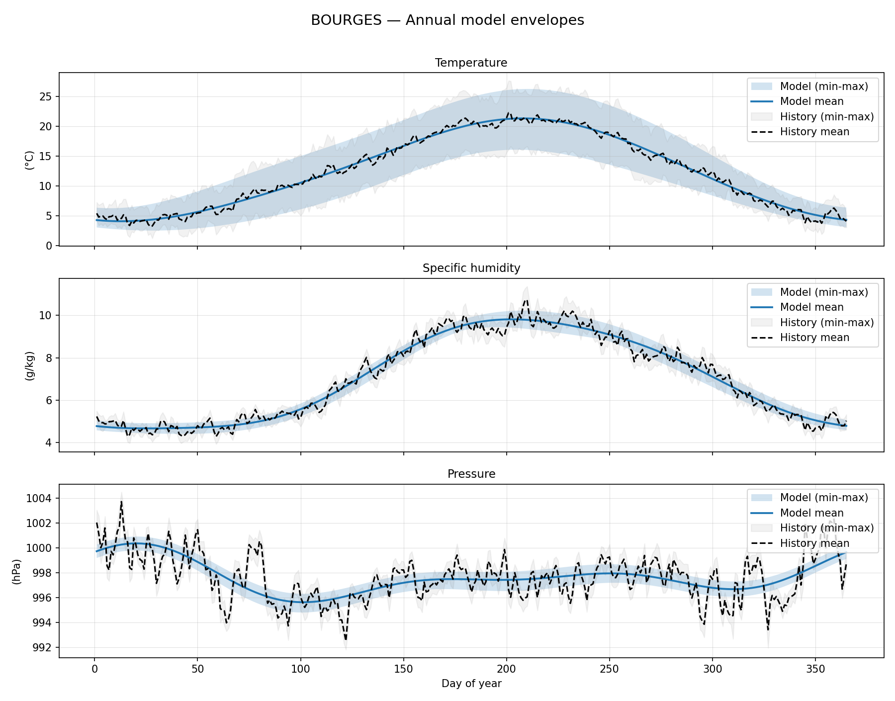
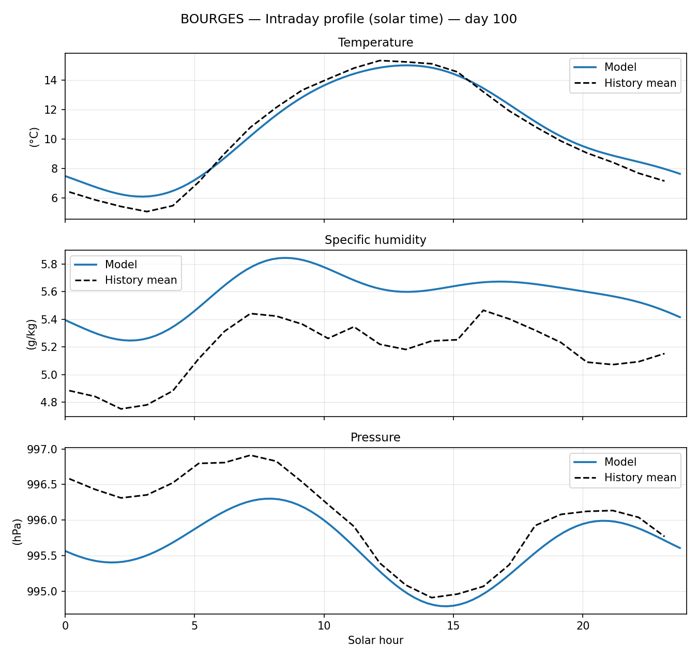

# HarmoClimate Model Generator

**HarmoClimate generates ultralight, location-tuned climate baselines, producing hourly temperature, station pressure, and specific humidity with a compact harmonic model** from a Météo-France station history data.

**Embed anywhere with zero extra dependencies.** Code templates are provided (e.g., C++) to integrate a generated model as a single, self-contained file.

The model uses a small, explainable set of harmonics, so each component can be inspected and, if needed, manually adjusted. An historical error envelope (quantile band derived from observations) lets you compare the baseline to real world data.

Robustness is assessed with Leave-One-Year-Out (LOYO) validation, holding out each year in turn and comparing RMSE for both the model and the historical mean climatology. The current bundle shows a typical positive LOYO skill of roughly +3% versus the historical mean baseline across the archived years.

## Typical Use Cases

- Estimate typical outdoor temperature and humidity cycles to support HVAC sizing, setpoint strategies, and lightweight energy simulations.
- Embed a deterministic, low-footprint climate model in firmware for low-power or offline environmental monitoring devices.
- Provide localized weather context when high-resolution forecasts are unavailable or too heavy, for example in games, simulations, or demos.
- Validate and sanity-check sensor or telemetry data against a reproducible local climate baseline to detect drifts or outliers.

**It is not intended to predict real-time weather events.**

## Showcase

The repository ships with several reference French weather stations that demonstrate the full pipeline and the generated model output. Below is the working example for the Bourges (FR) station.

### Model annual overview



### Model intraday profile (day 100)



## Generator Features

- Streams historical hourly observations for a French department directly from public Météo-France archives.
- Filters the source data down to a single station (configurable), normalises timestamps to UTC, and persists raw climatic fields; solar/orbital conversions are handled downstream by `harmoclimate.core`.
- Fits configurable linear harmonic models for temperature (°C), specific humidity (kg/kg), and pressure (hPa) via least-squares regression, caching per-year sufficient statistics for fast leave-one-year-out (LOYO) sweeps.
- Evaluates fitted models with a LOYO protocol against a no-leap UTC day/hour climatology (computed from all other years), capturing MAE envelopes plus per-year RMSE/skill metrics. Global LOYO RMSE/skill summaries are stored on each model JSON (`training_loyo_rmse`, `training_loyo_skill`), while detailed per-year reports live under `generated/models/training_metrics/`.
- Exports one JSON parameter bundle per target and generates a self-contained C++ header for embedded use.
- Provides optional visualisation helpers for comparing the generated model to historical climatology.

## Project Layout

```
.
├── main.py                          # Backwards-compatible CLI entry point
├── src/
│   └── harmoclimate/
│       ├── __init__.py              # Package exports
│       ├── config.py                # Station configuration + filesystem layout
│       ├── data_ingest.py           # Remote CSV streaming and preprocessing
│       ├── core.py                  # Solar/orbital conversions and shared thermodynamic helpers
│       ├── metadata.py              # Station metadata aggregation helpers
│       ├── pipeline.py              # End-to-end orchestration
│       ├── template_cpp.py          # C++ header generation utilities
│       ├── training.py              # Linear model assembly and training routines
│       └── display.py               # Plotting helpers for yearly and intraday charts
├── generated/
│   ├── data/                        # Filtered datasets (Parquet)
│   ├── models/                      # Exported JSON parameter bundles
│   └── templates/                   # Generated C++ headers
├── README.md
└── AGENTS.md
```

The `generated/` directory is tracked with placeholder files so that the folder structure exists in the repository, while the actual artefacts (Parquet, JSON, C++ headers) are ignored by Git.

## Configuration

Station-specific configuration lives in `src/harmoclimate/config.py`:

| Parameter | Description | Default |
|-----------|-------------|---------|
| `STATION_CODE` | Eight-digit `NUM_POSTE` identifier used as the default when no station code is provided to the CLI. | `"18033001"` (Bourges) |
| `COUNTRY_CODE` | ISO 3166-1 alpha-2 code stored in metadata. | `"fr"` |
| `MODEL_VERSION` | Version string embedded in exported metadata. | `"1.0"` |
| `AUTHOR_NAME` | Default author stored in exported metadata. | `"HarmoClimate"` |
| `CHUNK_SIZE` | Number of rows per streamed CSV chunk. | `200_000` |
| `N_DIURNAL_HARMONICS` | Number of diurnal harmonics used in the linear model. | `3` |
| `DEFAULT_ANNUAL_HARMONICS` | Annual harmonics per parameter when no override is provided. | `3` |
| `SAMPLES_PER_DAY` | Number of samples used in visualization helpers. | `96` |

Advanced users can fine-tune annual harmonics per parameter through the `ANNUAL_HARMONICS_PER_PARAM` mapping in the same module.

Helper functions such as `department_code_from_station()` and `build_artifact_paths()` derive the department code, file URLs, and output locations automatically. The pipeline inspects the dataset to fetch the station's `NOM_USUEL`, slugifies it, and then writes artefacts under the basename `{country_code}_{station_slug}` (e.g. `fr_bourges`).

## Prerequisites

- Python 3.10+
- `pyarrow` (installed via the project dependencies)
- POSIX-compatible shell (`bash`) to run project scripts

Set up a local development environment with the helper script:

```bash
./scripts/setup.sh
```

This creates `.venv/` and installs the project in editable mode. To reuse the environment later, activate it via:

```bash
source ./scripts/activate.sh
```

## Usage

The CLI exposes several workflows. All artefacts are written under `generated/{data,models,templates}/`.

1. **Generate a fresh model for a station code.**
   ```bash
   python main.py generate 18033001
   ```
   The command will:
   - Download and stream historical CSV archives for the department inferred from the `NUM_POSTE`.
   - Filter rows matching the provided station code, normalise timestamps to UTC, and persist raw climatic + station metadata.
   - Persist the filtered dataset to `generated/data/{country_code}_{station_slug}.parquet`.
   - Fit the linear harmonic models for temperature (°C), specific humidity (kg/kg), and pressure (hPa).
   - Report error envelopes plus LOYO diagnostics (global RMSE and skill) for temperature, specific humidity, and pressure.
   - Export the learned parameters and metadata to `generated/models/{country_code}_{station_slug}_temperature.json`, `generated/models/{country_code}_{station_slug}_specific_humidity.json`, and `generated/models/{country_code}_{station_slug}_pressure.json`.
   - Persist per-year LOYO metrics to `generated/models/training_metrics/{country_code}_{station_slug}_{target}_training_metrics.{json,csv}` and store the global RMSE/skill summaries on the model metadata (`training_loyo_rmse`, `training_loyo_skill`).
   - Generate a C++ header (`generated/templates/{country_code}_{station_slug}.hpp`) with inline prediction helpers.

2. **Regenerate outputs from an existing model JSON.**
   ```bash
   python main.py regenerate fr_bourges_temperature.json
   ```
   - If the corresponding cached Parquet dataset is present, it is loaded directly.
   - Otherwise the pipeline re-streams the archives using the `station_code` stored in the JSON metadata.
   - Training, evaluation, and export steps mirror the `generate` command.

3. **Render plots for an existing model.**
   ```bash
   python main.py display fr_bourges_temperature.json
   ```
   ```bash
   python main.py display fr_bourges_temperature.json --mode intraday --day 42
   ```
- The default (`--mode=annual`) resolves the companion humidity and pressure models automatically and saves a composite figure (temperature, specific humidity in g/kg, and pressure) to `generated/media/fr_bourges_annual.png`.
- Intraday mode renders a single-day solar-time profile (`generated/media/fr_bourges_intraday_100.png`) and requires the `--day` argument.
- Pass `--variables <codes...>` to control which panels render. The default is `T Q P`; include `RH`, `TD`, or `E` when you also need relative humidity, dew point, or vapor pressure (e.g. `--variables T RH TD Q E P`).
- Historical overlays appear in both annual and intraday plots whenever the cached Parquet dataset exists under `generated/data/`.
- Specific humidity plots display values in g/kg (coefficients remain stored in kg/kg).

4. **Generate an embedded template for existing models.**
   ```bash
   python main.py template fr_bourges cpp
   ```
   - Accepts either the shared model basename (`fr_bourges`) or any of the JSON filenames (e.g. `fr_bourges_temperature.json`).
   - Resolves the companion humidity and pressure bundles automatically before exporting the requested template.
   - Currently only the C++ header pathway is implemented (`generated/templates/fr_bourges.hpp`).

5. **Remove cached Parquet datasets.**
   ```bash
   python main.py clean
   ```
   - Deletes cached datasets stored under `generated/data/` so subsequent runs stream fresh data.
   - Leaves generated models, templates, and media artefacts untouched.

6. **Render plots for every generated model.**
   ```bash
   ./scripts/display_all.sh
   ```
   - Iterates over each station represented in `generated/models/`, using one bundle as the seed to render the annual composite figure via `python main.py display`.
   - Immediately replays the command with `--mode intraday --day 100` (when a temperature bundle exists) so every station ships a matching solar-day profile.
   - Stores the annual and intraday PNGs side by side under `generated/media/`, keeping the dashboard assets synchronized after retraining.

7. **Backwards-compatible default.**
   Running `python main.py` with no arguments still executes the pipeline using the `STATION_CODE` defined in `src/harmoclimate/config.py`. This is useful when scripting or when a default station is preferred.

## Generating a New Model

To produce a model for another French station, prefer the CLI:

1. Invoke `python main.py generate <NUM_POSTE>` with the desired station code.
2. Optionally adjust `MODEL_VERSION` in `src/harmoclimate/config.py` if you want to embed a custom revision tag in the metadata.
3. Review the output JSONs and C++ header inside `generated/` to confirm the metadata and coefficients align with the intended station.

## Model Parameters

Each JSON bundle exposes the coefficient layout (`params_layout`) and flattened coefficient vector (`coefficients`) used by the linear model. A complete description of every term—including units, meanings, and symbol cross-reference—lives in the [model parameter reference](./docs/parameters.md).

## License

See `LICENSE` for licensing details.
